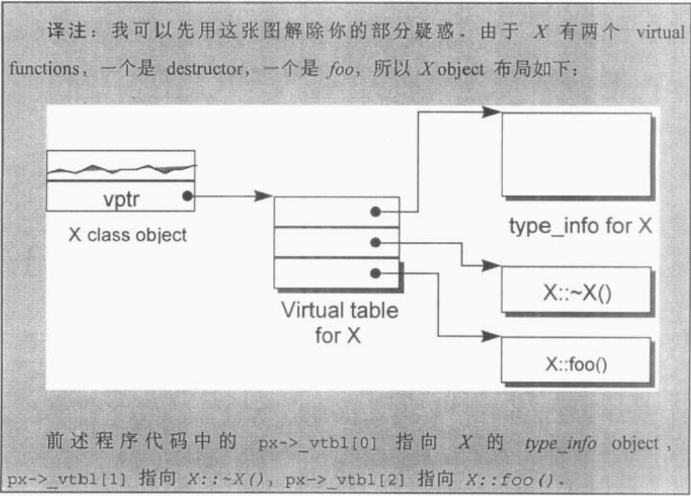
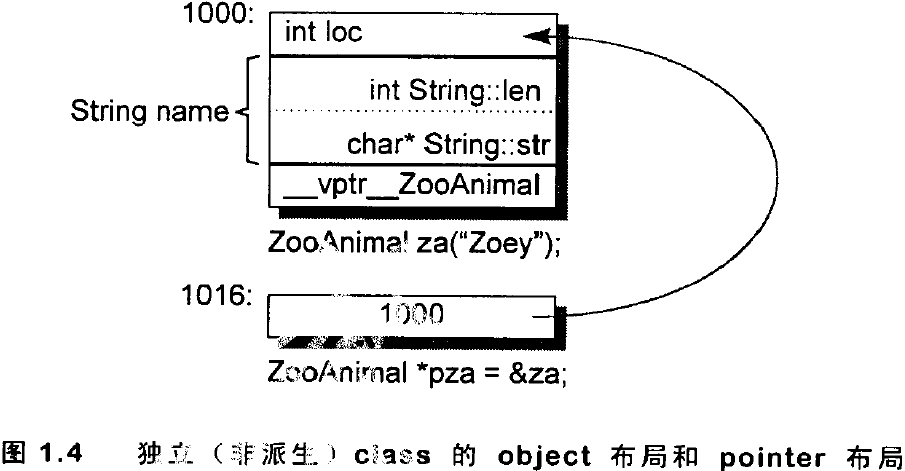

# 深入探索C++对象模型
--------------------
# 第1章 关于对象(Object Lessions)
## C++加上封装后的布局成本
以一个Point3D类为例子，分析了C++相对于C的布局成本。
在C语言中，Point3D的实现为：
```c
typedef struct point3d{
  float x;
  float y;
  float z;
}Point3D;

#define Point3d_print(pd) \
        printf("(%g, %g, %g)", pd->x, pd->y, pd->z);

#define X(p, xval) (p.x) = (xval);
//c语言中可以直接对Point3D对象直接存取。
```
在C++中有很多种实现方式，举一个模板的例子：
```c++
template < class type >
class Point3d{
public:
  Point3D( type x = 0.0, type y = 0.0, type z = 0.0 )
  : \_(x), \_y(y), \_z(z){}
  type x(){return \_x;}
  void x(type xval){\_x = xval;}
  //...etc..
private:
  type \_x;
  type \_y;
  type \_z;
};

inline
template <class type>
ostream &
operator<<(ostream &os, const Point3d<type> &pt)
{
  os << "(" << pt.\_x << pt.\_y << pt.\_z << ")";
}
```
但是实际上，class Point3d的布局成本并没有增加。
> * 三个data memebers直接内含在每一个class object之中，和C是一样的。
> * 而member functions虽然在class中声明，去不出现在object中。
> * 每一个non-inline member function只会诞生一个函数实体。
> * 至于每一个"拥有0个或1个定义"的inline function则会在其每一个使用者(模块)身上产生一个函数实体。

**真正导致C++布局以及存取时间上的overhead的是virtual，包括：**

> * virtual function机制。用以支持一个有效率的"执行期绑定"(runtime binding)。
> * virtual base class。用以实现"多次出现在继承体系中的base class，有一个单一而被共享的实体"。

**以及在多重继承下的额外负担：**

> * 一个derived class和其第二或后继之base class的转换

## 1.1 C++对象模式(The C++ Object Model)
假设有个class Point：
```c++
class Point{
public:
  Point(float xval);
  virtual ~Point();

  float x()const;
  static int PointCount();

protected:
  virtual ostream&
    print(ostream &os)const;

    float x;
    static int point_count;
}
```

那么它在机器中如何表示呢？也就说如何模塑(modeling)出各种data members和function members呢？下面介绍*三种对象模型*。

### **简单对象模型(A Simple Object Model)**

> * __简单对象模型的设计理念__：尽量降低C++编译器设计的复杂度，赔上空间和执行效率。在简单模型中，一个object是一系列的slots，每个slot指向一个member。members按照其声明的顺序，胳臂指定一个slot(即每个data memeber或function member都有自己的一个slot)。


> * __简单对象模型的优点__：简单对象模型中members本身并不存放在object中，只有*指向member的指针*才放在object中，这样做所有的members无论是什么类型都可以通过索引获取。虽然该模型没有应用于实际产品，不过索引或slot数目的观念倒是被应用到了C++的"指向成员的指针"观念之中。

## 表格驱动对象模型(A Table-driven Object Model)

> * 为了对所有classes的所有objects都有一只的表达方式，表格驱动对象模型是把所有与members相关的信息抽出来，放在一个data member table和一个member function table之中，class object本身则内含只想着两个表格的指针。Function member table是一系列的slots，么一个slot只出一个member function；Data member table则直接含有data本身。


> * __表格驱动对象模型的优点__：虽然表格驱动对象模型也没有真正应用于C++编译器上，但是function member table这个观念却成为支持virtual functions的一个有效方案。并且，接下来可以看到，在nonstatic data member有所修改的情况下，由于表格驱动对象模型多了一层间接性，它比C++对象模型更具有弹性(但是这种弹性是通过付出空间和执行效率两方面的代价获得的)。

## __C++对象模型(The C++ Object Model)__

`Stroustrup是如何设计C++对象模型的呢？`
> * nonstatic data members被配置与每一个class object中
> * static data members则被存放在所有的class object之外
> * static和nonstatic function members也被存放在所有的class object之外。
> * virtual functions则以以下两个步骤支持之：
> > * 每一个class产生出一堆指向virtual functions的指针，放在表格之中。这个表格被称为**virtual table(vtbl)**。
> > * 每一个class object被添加了一个指针(通常被称为vptr)，指向相关的virtual table。vptr的设定和重置都有每一个class的constructor、destructor和copy assignment运算符自动完成(详见第5章)。每一个class所关联的*type_info object*(用以支持RTTI)也经由virtual table被指出来，并且通常放在表格的第一个slot处。


> * C++对象模型的有点：在空间占用和存取时间上具有更高的效率
> * C++对象模型的缺点：如果应用程序代码本身未曾改变，但是用到的class objects的nonstatic data members有所修改(可能是增加、移除或更改)，那么那些用程序代码同样得重新编译。

### __加上继承(Adding Inheritance)__

C++支持单一继承：
```c++
class Library_materials{};
class Book : public Library_materials{};
class Rental_book : public Book{};
```
C++也支持多重继承：
```c++
//标准版之前的iostream实现方式
class iostream:
  public istream,
  public ostream {};
```
甚至，**C++继承关系也可以指定为虚拟(virtual，也就是共享的意思)**：
```c++
class istream : virtual public ios {};
class ostream : virtual public ios {};
```


> *在虚拟继承的情况下，base class不管在继承串链中被派生多少次，永远只会存在一个实体(称为**subobject**)。例如在iostream之中就只有virtual ios base class的一个实体。*

`那么derived class如何在本质上模塑其base class 的本体呢？`
> * 在`简单对象模型`中，每一个base class可以被derived class object内的一个slot指出，该slot内含base class subobject的地址。这样做的缺点是，因为间接向而导致空间和存取时间上的额外负担，优点则是class object的大小不会因其base classes的改变而受影响。
> * 可以设计一种`base table`模型。在`base class table`被产生出来时，表格中的每一个slot内含一个相关的base class地址(与virtual table内含每一个virtual function的地址相似)。每一个class object内含一个bptr，它会被初始化，指向其`base class table`。这种策略的`主要缺点`是：由于间接性而导致的空间和存取时间上的额外负担；`有2个优点`：首先，每一个class object中对于继承都有一致的表现方式：每一个class object都应该在某个固定位置上安放一个base table指针，与base classes的大小伙数目无关。其次，不需要改变class objects本身，就可以放大、缩小、或更改base class tabel。


对于上述两种体制，"间接性"的级数都将因为继承的深度而增加。例如一个Rental_book需要两次简介存取才能够探取到继承自Library_materials的members，而Book只需要一次。如果在derived class内复制一个指针，只想继承串中的每一个base class，倒是可以获得一个永远不变的存取时间，当然这必须付出代价，因外需要额外的空间来放置额外的指针。

`C++最初采用的继承模型并与运用任何间接性`：base class subobject的data members被放置于derived class object中。这提供了对base class members最紧凑而且最有效率的存取。但是相对的缺点是：base class members的任何改变、包括增加、移除或改变类型等等，都是的所有用到"此base class或其derived class之objects"者必须重新编译。

**C++ virtual base class**的原始模型是在class object中为每一个有关联的virtual base class加上一个指针。(**详见3.4节**)

### 对象模型如何影响程序(How the Object Model Effects Programs)
`不同的对象模型会导致"现有的程序代码必须修改"`。例如，class X定义了一个copy constructor，一个virtual destructor，和一个virtual function foo()：

```c++
X foobar(){
  X xx;
  X *px = new X;

  //foo()是一个virtual function
  xx.foo();
  px->foo();

  delete px;
  return xx;
}
```

这个函数有可能在内部被转化为：
```c++
//可能的内部转换结果
//虚拟c++ 码
void foorbar(X &result)
{
  //构造result
  //result用来取代local xx ...
  result.X::X();

  //扩展X \*px = new X;
  px = \_new(sizeof(X));
  if(px != 0)
    px->X::X();

  //扩展xx.foo()但不使用virtual机制
  //以result取代xx
  foo(&result);

  //使用virtual机制扩展px->foo()
  (\*px->vtbl[2])(px);

  //扩展delete px
  if(px != 0){
    (\*px->vtbl[1])(px);  //destructor
    \_delete(px);
  }

  //不需要使用named return statement
  //不需要摧毁local object xx
  return;
}
```




## **1.2 关键词带来的差异(A Keyword Distinciton)**
C/C++之间的不兼容，具体内容需要参考第3节。

## **对象的差异(An Object Distinction)**
`典范(paradigm)`的解释：
> paradigm：一种环境设计和方法论的模型或范例；系统和软件以此模型来开发和运行。一个现役的点发可能会有数个开发中的替代典范。以下是一些大家比较首席的典范：函数化程序设计、逻辑程序设计、语义数据模型、几何计算、数据计算、面向对象设计、原型设计、自然语言。

C++程序设计模型直接支持三种程序设计典范(programming paradigms):
### (1)程序模型(procedural model)
和C一样，C++也支持该模型。字符串处理及时一个例子，我们可以使用字符数组以及定义在标准的C函数库中的str*函数集：
```c
char boy[] = "Dany";
char *p_son;

p_son = new char[strlen(boy)+1];
strcpy(p_son, boy);
/*...*/
if(!strcmp(p_son, boy))
  take_to_disneyland(boy);
```
### (2)抽象数据类型模型(abstract data type model,ADT)
该模型所谓“抽象”是将数据和一组表达式(public接口)一起提供，而其运算定义仍然是不可见的。例如String class：
```c++
String girl = "Anna";
String daughter;
//String::operator=();
daughter = girl;
//String::operator==();
if(gir == daughter)
  take_to_disneyland(girl);
```
###(3)面向对象模型(object-oriented model,OO)
该模型中有一些彼此相关的类型，通过一个抽象的base class(用以提供共同接口)被封装起来。Library_materials class就是一个例子，真正的subtypes例如Book、Video、Compact_Disc、Puppet、Laptop等等都可以从那里派生而来：
```c++
void check_in(Library_materials *pmat){
  if(pmat->late())
    pmat->fine();
  pmat->check_in();

  if(Lender *plend = pmat->reserved())
    pmat->notify(plend);
}
```

纯粹以一种paradigm写程序，有助于整体行为的良好稳固；然而如果混合了不同的paradimgs就有可能会带来让人惊吓的后果，特别是在没有谨慎处理的情况下。

最常见的疏忽发生在当你以一个base class的具体实体如：`Library_materials thing1`来完成某种多态局面时：
```c++
//class Book:public Library_materials {...};
Book book;
//thing1并不是一个Book，因此book被裁切(sliced)了
//thing1仍然抱有一个Library_materials
thing1 = book;
//调用的是Libra::check_in()
thing1.check_in();
```
正确的做法是通过base class的pointer和reference来完成多态：
```c++
Library_materials &thing2 = book;
thing2.check_in()
```
虽然你可以直接或间接处理及成体系中的一个base class object，但是只有通过pointer或reference的见解处理，才支持OO程序设计所需的多态性质。删个例子中的thing2的定义和运用是OO paradigm中一个良好的例证。thing1的定义和运用则溢出了OO的习惯，它反映的是一个ADT paradigm的良好行为。thing1的行为是好是坏，是程序员的意图而定。但是在此范例中，他的行为非常有可能不是你要的！

在OO paradigm之中，程序员需要处理一个未知实体，他的类型虽然有所界定，却有无穷可能。这组类型受限于其继承体系，然而该体系理论上没有深度和广度的限制。原则上，被指定的object的真实类型在每一个特定执行点之前，是无法解析的。在C++中，只有通过pointers和references的操作才能够完成。相反的，在ADT paradigm中程序员处理的是一个拥有固定而单一类型的实体，它在编译时期就已经完全定义好了。例如：
```c++
//描述objects：不确定类型
Library_materials *px = retrive_some_material();
Library_materials &rx = *px;

//描述已知物：不能能有令人惊讶的结果产生
Library_materials dx = *px;
```
你绝对没有办法确定地说出px或rx到底指向何种类型的objects，你只能够说它要不就是Library_materials object，要不就是后者的一个子类型(subtype)。不过，我们倒是可以确定，dx只能是Library_materials class的一个object。(我们稍后会讨论为什么这样的行为虽然或许为如你所预期，却是良好的行为)

虽然"对于object的多态操作"要求此object必须可以经由一个pointer或reference来存取，然而C++中的pointer或reference的处理却不是多态的必要结果：
```c++
//操作对象不是class object因此没有多态
int *pi;
void *pvi;
//如果把class x视作一个base class则有多态的效果
X *px;
```
***

因此，**在C++中，多态只存在于一个个的public class体系中，例如px可能指向一个父类的object，也可能执行一个以public派生而来的一个类型。**
nonpublic的派生行为以及类型为void*的指针可以说是多态，但它们并没有被预言明白的支持，也就说它们必须由程序员通过明白的转型操作来管理(你或许可以说他们并不是多台对象的一线选手)。

**C++以以下方法支持多态：**
1.经由一组隐含的转化操作。例如把一个derived class指针转化为一个指向其public base type的指针：
```c++
//circle drived from shape
shape *ps = new circle();
```
2.经由virtual function机制：
```c++
//实际调用circle::rotate()
ps->rotate();
```
3.经由dynamic_cast和typeid运算符
```c++
if(circle *pc = dynamic_cast<circle *>(ps))
```
***

`关于dynamic_cast和typeid:它们是RTTI(RunTime Type Infomation)提供的两个非常有用的操作符。其中：`
> (1) typeid：返回指针和引用所知的实际类型。

> (2) dynamic_cast：它可以完成(1)将派生类对象的指针或者引用转为其基类的指针或者引用；更厉害的是(2)将基类指针或者引用(无论指向或者引用的对象类型是什么)转为其派生类的指针或者引用(但这种用法只有在转换的目标指针或引用类型和实际对象的类型匹配的时候才可以通过指针或者引用调用方法！！)。
> > 举例如下：
```c++
class Base{
public:
  virtual void dowork();
};
class Employee : public Base{
public :
  virtual void dowork();
};
class Employer : public Base{
public :
  virtual void dowork();
};
Base &b1 = dynamic_cast<Employee &>(Employee());
Employer &reer = dynamic_cast<Employer &>(b1);//可以编译通过，但是会warninig提示该转换是不可使用的
reer.dowork();//试图调用Employer::dowork()执行错误！！
Employee &reee = dynamic_cast<Employee &>(b1);
reee.dowork();//正确，调用Employee::dowork()
```
***
> > 正确使用例子(注意，友元不可继承，派生类Derived可以使用其基类的友元函数bool operator==(const Base &, const Base &)完全是因为形式参数的匹配：即派生类对象可以传给基类的引用或指针！！！)：
```c++
#include <iostream>
#include <string>
#include <typeinfo>

using namespace std;

//*****Base*******
class Base{
friend bool operator==(const Base &, const Base &);
protected:
    string name;
    int age;
    virtual bool equal(const Base &) const;
public:
    Base(){}
    Base(string n, int a):name(n), age(a){}
};

bool Base::equal(const Base &b) const{
    return (b.name == name) && (b.age) == age;
}

bool operator==(const Base &lhs, const Base &rhs){
    return typeid(lhs) == typeid(rhs) && lhs.equal(rhs);
}

//*******Derived*************
class Derived : public Base{
protected:
    string coroperation;
    virtual bool equal(const Base &) const;
public:
    Derived(){}
    Derived(string n, int a, string c):Base(n, a),coroperation(c){}
};

bool Derived::equal(const Base &rhs) const{
    auto r = dynamic_cast<const Derived &>(rhs);
    return Base::equal(r) && r.coroperation == coroperation;
}

int main(){
    Base b1(string("Hans"), 27);
    Base b2 = b1;
    Derived d1(string("Hans"), 27, string("RealTech"));
    Derived d2 = d1;

    if(b1 == b2){
        cout << "b1 == b2" << endl;
    }else{
        cout << "b1 != b2" << endl;
    }

    if(d1 ==d2){
        cout << "d1 == d2" << endl;
    }else{
        cout << "d1 != d2" << endl;
    }

    if(b1 == d2){
        cout << "b1 == d2" << endl;
    }else{
        cout << "b1 != d2" << endl;
    }

    return 0;
}
```
***

多态的主要途径是经由一个共同的接口来影响类型的封装，这个几口通常被定义在一个抽象的base class中。例如Library_materials class就为 Book、Video、Puppet等subtype定义了一个接口。这个共享接口是以virtual function机制引发的，它可以在执行期根据object的真正类型解析出到底是哪一个函数实体被调用。这样的好处就是，每个派生类只要维护自己的实现，派生类之间不会互相影响。

**一个class object需要多大的内存空间**
一般而言要考虑：
> * 其nonstatic data members的总和大小
> * 任何由于alignment的有需求而padding上去的空间(可能存在于members之间，也可能存在于集合体(struct)边界)。
> > alignment是指将数值调整到某数的倍数。在32位计算机上，通常alignment为4bytes，以使得bus的"运输量"达到最高效率。
> * 为了支持virtual而有内部产生的任何额外负担(overhead)。

例如：
```c++
class ZooAnimal{
public:
  ZooAnimal();
  virtual ~ZooAnimal();
  virtual void rotate();
protected:
  int loc;
  string name;
};

ZooAnimal za("Zoey");
ZooAnimal *pza = &za;
```
***
在32位机器上其空间布局可能为：


上图中假设string是传统的8-bytes(包括一个4-bytes的字符指针和一个用来表示字符长度的整数)。
从本质上讲，只要是`指针`其占用内存的大小都是机器字长，普通类型指针和类之指针的区别是它们在编译器的解释不同：``"指针类型"``会教导编译器如何解释某个特定地址中的内存内容及其大小。

**加上多台之后的内存布局变化**
```c++
class Bear : public ZooAnimal{
public:
  Bear();
  ~Bear();
  void rotate();
  virtual void dance();
protected:
  enum Dances {...}
  Dances Dances_known;
  int cell_block;
};

Bear b("Yogi");
Bear *pb = &b;
Bear &rb = *pb;
```


实际上，一个指向同样Bear对象的ZooAnimal指针和其派生列的指针的区别在覆盖范围：前者只能覆盖图中灰色的内存区域。
```c++
Bear b;
ZooAnimal *pz = &b;
Bear *pb = &b;
```
另外，除了b中其父类ZooAnimal对象的members，pz不能够直接处理其派生类对象b的任何members(**唯一的例外是virtual机制**)：
```c++
//即使pz当前指向一个派生类对象，但是直接调用cell_block并不合法
pz->cell_block;

//通过一个downcast来操作
((Bear *)pz)->cell_block;

//更好但成本较高的方法：run-time operation
if(Bear *pb2 = dynamic_cast<Bear *>(pz))
  pb2->cell_block;
```
***

而在调用
```c++
pz->rotate();
```
时，pz的类型将在编译时期决定以下两点：
> * 固定的可用接口。也就是说pz只能够调用ZooAnimal的public接口。
> * 该接口的access level(例如rotate()是ZooAnimal的一个public member)。

**在每一个执行点，pz所指的object类型可以决定rotate()所调用的实体。类型信息的封装并不是维护于pz之中，而是维护于link值z中，此link存在于"object的vptr"和"vptr所指的virtual table" 之间(简单来说就是vptr指向的virtual table之前有一个type_info。详见4.2对于virtual functions的完整讨论)。**


**sliced派生类**
下面看看这种情况：
```c++
Bear b;
ZooAnimal za = b;//b被sliced
za.rotate();//调用ZooAnimal::rotate()
```
有2个问题：
> 1. 为什么rotate()调用的是ZooAnimal的实体而不是Bear的实体？
> 2. 如果初始化函数(应用与上述assignment操作发生时)讲一个object内容完整地拷贝到另一个object中区，为什么za的vptr不指向Bear的virtual table ?

答案：
> 对于第二个问题：编译器在(1)初始化及(2)指定(assignment)操作(讲一个class object指定给另一个class object)之间做出了仲裁：编译器必须确保如果某个object含有一个个或一个以上的vptrs，那些vptrs的内容不会被base class object初始化或改变。

> 对于第一个问题：za并不是而且也绝不会是一个Bear，他只能是一个ZooAnimal。多态虽然具备"一个以上的类型"的潜在力量，但是并不能实际发挥在"直接存取objects"这件事情上。例如：
```c++
{
  //Panda继承自Bear
  ZooAnimal za;
  ZooAnimal *pza;
  Bear b;
  Panda *pp = new Panda;
  pza = &b;
}
```
***
其内存布局如图1.6所示：


> 将派生类对象的地址指定给基类指针pza完全是ok的。从本质上说，一个pointer或一个refernce之所以支持多态，是因为他们并不引发内存中任何"与内存相关的内存委托操作(type-dependent commitment)"，会受到改变的只是他们所指向的内存的"大小和内容解释方式"而已。

> 当一个base class object被直接初始化为一个derived class object时，derived object就会被切割(sliced)，一塞入较小的base type内存中，derived type将没有留下任何蛛丝马迹。多态于是不再呈现，而一个严格的编译器可以在编译时期解析一个"通过该object而触发的virtual function调用操作"，因而回避virtual机制。入股virtual function被定义为inline则更会有效率上的大收获。

## OO与(OB)设计风格对比
p34
